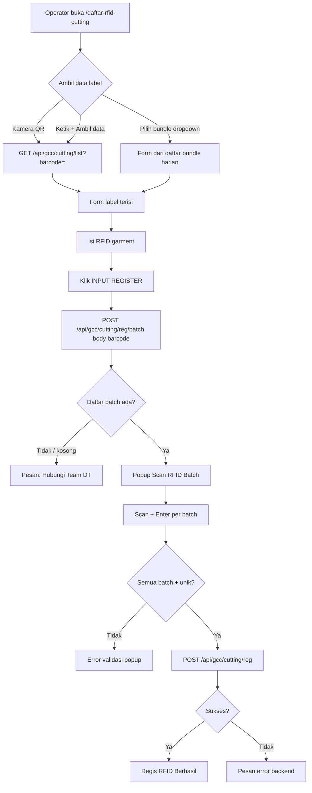

# Registrasi Scan Cutting — prosedural

Dokumen ini menjelaskan **alur kerja saat ini** fitur **Daftar RFID Cutting** (`/daftar-rfid-cutting`): operator scan label bundle, isi RFID garment, scan RFID per batch, lalu data tersimpan ke service cutting GCC.

**Backend utama:** `http://10.5.0.107:9000`  
**Halaman UI:** `src/pages/DaftarRFIDCutting.tsx`  
**Fungsi API:** `src/config/api.ts`

---

## 1. Prasyarat

| Item | Keterangan |
|------|------------|
| Login | User sudah login; NIK tersimpan di `localStorage` (dipakai saat register ke backend). |
| Label cutting | Barcode/QR label bundle valid (contoh: `BD20260504-566275`). |
| RFID garment | Tag RFID untuk **bundle/garment** (diisi manual atau scanner). |
| RFID batch | Satu tag RFID **unik per batch** — jumlahnya mengikuti daftar batch dari server. |
| Data batch | Batch harus sudah **di-plot** di sistem DT. Jika belum → registrasi tidak bisa dilanjutkan. |
| Header API | `rfid-key: 0011779933` (bisa dioverride lewat env `VITE_GCC_CUTTING_RFID_KEY`). |

---

## 2. Prosedur operator (langkah demi langkah)

### Langkah A — Buka halaman

1. Masuk aplikasi → menu **Daftar RFID Cutting** (`/daftar-rfid-cutting`).
2. (Opsional) Atur **tanggal filter** di pojok kiri atas untuk daftar bundle historis.

### Langkah B — Ambil data label bundle

Pilih **salah satu** cara berikut:

| Cara | Tindakan | Hasil |
|------|----------|--------|
| **Scan kamera** | Klik ikon kamera → arahkan ke QR/barcode label | Barcode terbaca → form terisi otomatis |
| **Ketik manual** | Isi field barcode → klik **Ambil data** (atau Enter) | Form terisi dari API |
| **Pilih bundle** | Dropdown **Barcode label** → pilih baris bundle (sesuai tanggal filter) | Form + RFID garment (jika sudah ada) terisi |

Field yang terisi (read-only kecuali RFID):

- Barcode label, Work Order, No. Ikat, Placing/Meja  
- Style, buyer, warna, size, dll. (internal form — tidak semua ditampilkan di grid utama)

### Langkah C — Isi RFID garment

1. Ketik atau scan **RFID garment** di field kuning **RFID garment**.
2. Pastikan **barcode** dan **Work Order** tidak kosong.

### Langkah D — Input Register (muat daftar batch)

1. Klik tombol **INPUT REGISTER** (atau Enter di field RFID garment).
2. Sistem memanggil API daftar batch untuk barcode tersebut.
3. **Jika batch kosong / belum di-plot** → tampil pesan:  
   `Hubungi Team DT karena data batch belum di plot` → **stop**, hubungi Team DT.
4. **Jika batch ada** → popup **Scan RFID Batch** terbuka; jumlah batch = jumlah baris dari server.

### Langkah E — Scan RFID per batch (popup)

1. Popup menampilkan **Batch aktif** (Batch 1, Batch 2, … beserta keterangan `ket_batch` jika ada).
2. Tempel/scan RFID batch ke **RFID reader desktop** — input otomatis fokus tanpa perlu klik.
3. Tekan **Enter** setelah setiap scan:
   - Batch 1 → Enter → lanjut Batch 2  
   - … hingga batch terakhir  
4. **Batch terakhir + Enter** → sistem langsung **submit register** ke server.
5. Validasi sebelum submit:
   - Semua batch harus sudah di-scan (tidak boleh kosong).
   - **RFID batch tidak boleh duplikat** antar batch.
6. **Sukses** → popup tutup, pesan `Regis RFID Berhasil.`, field RFID garment dikosongkan.
7. **Gagal** → pesan error di popup (mis. error dari backend register).

### Langkah F — Selesai / ulang

- Untuk bundle berikutnya, ulangi dari **Langkah B**.
- Tombol **X** di popup scan batch membatalkan proses scan (data batch di popup direset).

---

## 3. Diagram alur sistem



---

## 4. Alur teknis (aplikasi)

### 4.1 Ambil data label

| | |
|---|---|
| **Fungsi** | `fetchGccCuttingListByBarcode(barcode)` |
| **Method** | `GET` |
| **URL browser** | `{origin}/api/gcc/cutting/list?barcode={BARCODE}` |
| **Backend** | `GET http://10.5.0.107:9000/api/gcc/cutting/list?barcode={BARCODE}` |
| **Header** | `Accept: application/json`, `rfid-key: …` |
| **Mapping UI** | `mapGccCuttingPayloadToForm()` → field form |

**Daftar bundle harian (dropdown):**

| | |
|---|---|
| **Fungsi** | `fetchGccCuttingBundlesList()` → filter tanggal lokal |
| **Method** | `GET` |
| **URL** | `/api/gcc/cutting/list` (tanpa query = semua, difilter di client) |

### 4.2 Muat daftar batch (sebelum scan RFID batch)

Browser **tidak bisa** `GET` + body. Karena backend upstream membutuhkan **GET dengan body `{ barcode }`**, frontend memakai **POST ke proxy** yang meneruskan sebagai GET + body.

| Lapisan | Method | URL | Body |
|---------|--------|-----|------|
| **Browser** | `POST` | `/api/gcc/cutting/reg/batch` | `{ "barcode": "BD20260504-566275" }` |
| **Proxy dev (Vite)** | → `GET` + body | `10.5.0.107:9000/api/gcc/cutting/reg/batch` | sama |
| **Proxy prod (`server.js`)** | → `GET` + body | `10.5.0.107:9000/api/gcc/cutting/reg/batch` | sama |

**Fungsi:** `fetchGccCuttingRegBatchList(barcode)`

**Respons sukses (contoh struktur):**

```json
{
  "code": 200,
  "status": "success",
  "count": 5,
  "data": [
    {
      "id_bundles": 123,
      "barcode": "BD20260504-566275",
      "batch": 1,
      "ket_batch": "Body",
      "rfid_batch": null,
      "qty_bundles": 1
    }
  ]
}
```

Baris diurutkan ascending by `batch` (`sortGccCuttingRegBatchRows`).

### 4.3 Submit registrasi (RFID garment + RFID batch)

| | |
|---|---|
| **Fungsi** | `postGccCuttingBundleBatchRegister(body)` |
| **Method** | `POST` |
| **URL browser** | `{origin}/api/gcc/cutting/reg` |
| **Backend** | `POST http://10.5.0.107:9000/api/gcc/cutting/reg` |

**Request body:**

```json
{
  "barcode": "BD20260504-566275",
  "rfid_bundles": "001234567890",
  "rfid_batch": [
    { "batch": 1, "rfid_batch": "RFID_BATCH_001" },
    { "batch": 2, "rfid_batch": "RFID_BATCH_002" }
  ]
}
```

| Field | Sumber |
|-------|--------|
| `barcode` | Form label |
| `rfid_bundles` | Field **RFID garment** |
| `rfid_batch[].batch` | Nomor batch dari respons `/reg/batch` |
| `rfid_batch[].rfid_batch` | Hasil scan di popup per batch |

**Sukses UI:** `Regis RFID Berhasil.`

---

## 5. Validasi & pesan error

| Kondisi | Pesan / perilaku |
|---------|------------------|
| Barcode kosong saat ambil data | `Barcode tidak boleh kosong` / `Barcode kosong` |
| RFID garment kosong | `Isi RFID garment terlebih dahulu.` |
| Barcode/WO kosong saat register | `Data label belum lengkap…` / `Work Order kosong…` |
| Batch belum di-plot / `data` kosong | `Hubungi Team DT karena data batch belum di plot` |
| Batch belum di-scan | `{Batch N — …} belum di-scan.` |
| RFID batch duplikat | `RFID duplikat terdeteksi pada Batch X dan Batch Y…` |
| Register backend gagal | Pesan dari API / `Gagal input register batch.` |
| Register sukses | `Regis RFID Berhasil.` |

---

## 6. Proxy & environment

| Mode | `/api/gcc/cutting/list`, `/reg` | `/api/gcc/cutting/reg/batch` |
|------|----------------------------------|------------------------------|
| **Dev (Vite :5173)** | Vite proxy → `server.js` (:8000) → :9000 | Plugin `gccCuttingRegBatchProxyPlugin`: POST browser → GET+body :9000 |
| **Prod (`server.js`)** | Forward langsung ke :9000 | Route khusus POST → GET+body :9000 |

**Env override (opsional):**

- `VITE_GCC_CUTTING_LIST_URL`
- `VITE_GCC_CUTTING_REG_URL`
- `VITE_GCC_CUTTING_REG_BATCH_URL`
- `VITE_GCC_CUTTING_RFID_KEY` / `VITE_GCC_CUTTING_RFID_KEY_HEADER`

Di browser, URL API ditampilkan **same-origin** (`/api/gcc/cutting/...`) agar Network tab sesuai path backend.

---

## 7. Ringkasan endpoint

| Tahap | Method (browser) | Endpoint | Keterangan |
|-------|------------------|----------|------------|
| 1. Data label | `GET` | `/api/gcc/cutting/list?barcode=` | Isi form dari label |
| 1b. Daftar bundle | `GET` | `/api/gcc/cutting/list` | Dropdown bundle per tanggal |
| 2. Daftar batch | `POST` | `/api/gcc/cutting/reg/batch` | Body `{ barcode }` → proxy GET+body |
| 3. Simpan register | `POST` | `/api/gcc/cutting/reg` | Body barcode + rfid_bundles + rfid_batch[] |

---

## 8. Referensi kode

| File | Peran |
|------|--------|
| `src/pages/DaftarRFIDCutting.tsx` | UI, validasi, popup scan batch |
| `src/config/api.ts` | `fetchGccCuttingListByBarcode`, `fetchGccCuttingRegBatchList`, `postGccCuttingBundleBatchRegister` |
| `src/components/cutting/CuttingLabelScanModal.tsx` | Scan QR/barcode kamera |
| `vite.config.ts` | `gccCuttingRegBatchProxyPlugin`, proxy `/api/gcc/cutting/*` |
| `server.js` | POST `/api/gcc/cutting/reg/batch`, forward cutting :9000 |
| `docs/CUTTING_PROSES_API.md` | Kontrak API cutting lain (output, QC, supermarket) |

---

## 9. Catatan operasional

1. **RFID reader desktop** di popup batch: fokus input dikunci otomatis agar scan langsung masuk tanpa klik.
2. **Enter** = konfirmasi batch aktif; batch terakhir + Enter = submit otomatis.
3. Registrasi **bergantung plotting batch DT** — tanpa data batch di server, operator tidak bisa melanjutkan scan RFID batch.
4. Endpoint register **lama** (`POST /api/gcc/cutting/reg` dengan payload penuh WO/style/size) masih ada di kode (`postGccCuttingBundleRegister`) untuk keperluan lain; **alur Daftar RFID Cutting saat ini** memakai payload **batch** (`barcode` + `rfid_bundles` + `rfid_batch[]`) seperti di atas.
